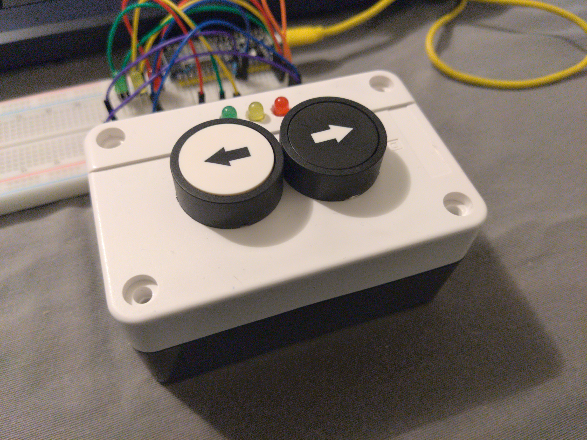

# GMGNcontroller

GMGNcontroller is an ESP32-based project that triggers Nostr NIP-01 Kind 1 events via button presses. This lightweight project allows you to send "Good Morning" (GM) or "Good Night" (GN) messages by simply pressing a button. It leverages the [arduino-nostr](https://github.com/lnbits/arduino-nostr) library.

## Overview

- **Core Functionality:** Trigger Nostr Kind 1 events with button presses  
- **Buttons:**
  - **Btn1:** Posts GM (Good Morning) - Can be whatever
  - **Btn2:** Posts GN (Good Night) - Can be whatever
- **Configuration:** Easily configurable via a webserver hosted on `192.168.4.1`
- **WiFi Access Point:** When the ESP32 boots, it creates the `GMGNcontroller` WiFi network (Password: `gmgnprotocol`) for 5 minutes, allowing you to configure settings.

## Features

- **Customizable Messages:** Change the GM/GN messages via the webserver.
- **Configurable Button Timing:** Set specific UTC times during which each button is active.
- **Cooldown Timer:** Define a pause interval between button presses.
- **User Personalization:** Set your user name, and receive personalized greetings (e.g., GM `{userName}` or GN `{userName}`) with a blinking green LED in Morse code.
- **Relay Selection:** By default, the system selects relay 3. However, you can choose any relay by leaving or modifying the relay settings but don't chose more then 3.
- **Visual Feedback:** Three LEDs indicate different statuses and processes running in the background.
- **Battery Optimization:** The configuration mode is only active for 5 minutes after boot to enhance security and save battery if running on battery power.

## Setup & Usage

1. **Hardware:**
   - ESP WROOM 32 (ESP32-D0WD-V3 (revision v3.0)) microcontroller  or other esp32 with wifi module will probably work.
   - 3 LEDs Green, Yellow, Red
   - 3 Resistors for LEDs
   - Buttons

2. **Firmware Upload:**
   - Open the new project in your Arduino IDE.
   - Ensure that the [arduino-nostr](https://github.com/lnbits/arduino-nostr) library is installed.
   - You'll also need a few more libraries arduino-nostr is dependant on - **ArduinoJson 7.3.1**, **uBitcoin 0.2.0**, and **WebSockets 2.6.1**
   - Verify and compile and that's it. If all went well, all 3 LEDs should start blinking on boot for a few seconds.

   

3. **Configuration:**
   - On boot, the ESP32 creates a WiFi network named `GMGNcontroller`. Use password `gmgnprotocol`.
   - Connect to this network within the 5-minute window.
   - Navigate to `http://192.168.4.1` in your web browser to access the configuration interface.
   - Configure:
     - Custom GM and GN messages
     - Active times for each button (UTC)
     - Cooldown timer between button presses
     - Your user name for personalized greetings
     - Relay preferences (if you want a different relay than the default)
     - home wifi credentials
     - nostr credentials for the key which will sign and post events
    - Click save and the device should reboot. After all three LEDs stop blinking, wait for 5 min before you press the button 

4. **Operation:**
   - After configuration,the device will automatically disable the WiFi network after 5 minutes for security and power saving.
   - After every reboot there's a 5 min waiting period before Buttons start triggering events and in this time WiFi AP is active. Let's say that buttons are warming up.
   - After the warming up period, press Btn1 or Btn2 to post a message to Nostr.

## Contributing

Feel free to fork the repository, open issues, or submit pull requests if you have suggestions or improvements. Contributions are always welcome!
